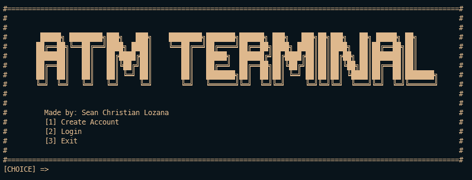

 
<h3 align="center"> Automated Teller Machine Terminal-based Program
</h3>
A Terminal-based Automated Teller Machine program which lets your store and create Account information, Log-in to the account and do basic features an ATM have.

## About the Program
As mentioned earlier, this program allows you to create and store it, you can also do the following:
* Deposit
* Withdraw
* Login

This program is best for beginners who are trying to learn Linked Lists and OOP and how it can be used for real-life solutions like an ATM.

### Built with
This terminal-based program is built with C++

## Getting Started
#### Prerequisites
Make sure you have <a href="https://gcc.gnu.org/install/">`gcc/g++`</a> installed in your desktop/laptop
#### Installation
  1. Clone the repository or download it as zip, if you don't know how; <a href = "https://www.howtogeek.com/451360/how-to-clone-a-github-repository/">Click here</a>
  2. If you didn't download it locally or if you're working with terminals you can paste this code `git checkout -t origin/ConsolePrograms`
  3. If all is good you can now proceed to compile the main file inside the `./src` directory
  4. Enjoy! Don't forget to ⭐ the repo!

## Sample
###### Creating Account

###### Logging In

## Contribution
Contributions are what make the open source community such an amazing place to be learn, inspire, and create. Any contributions you make are greatly appreciated.

* Fork the Project
* Create your Feature Branch `(git checkout - b feature/AmazingFeature)`
* Commit your Changes `(git commit -m 'Add some AmazingFeature')`
* Push to the Branch `(git push origin feature/AmazingFeature)`
* Open a Pull Request

## Contact
Sean Christian Lozana - https://github.com/lozanasc - https://twitter.com/lozanascboi  
Project Link - https://github.com/lozanasc/lozanasc_school
