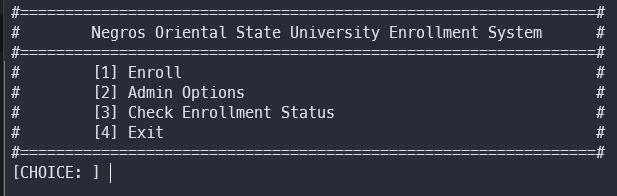
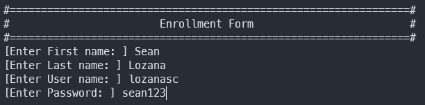
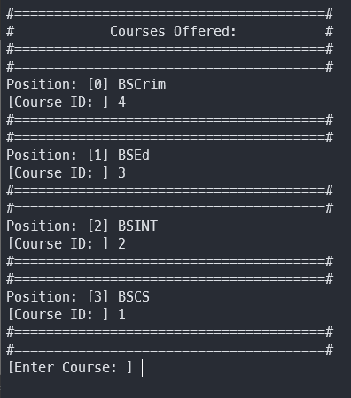
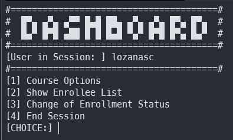
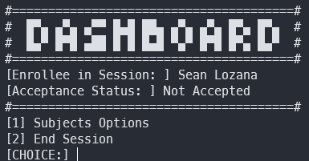

 
<h3 align="center">
A Terminal-based Enrollment Console Program
</h3>
A Terminal-based Enrollment Program that tries to mimic NORSU's current local Enrollment System.

## About the Program
As mentioned, the objective of this program is to mimic our University's Enrollment System that is implemented locally in the campus. It allows users and faculty to do the ff:  

#### Faculty
* Register
* Login
* Store/Create/Delete Course
* Approve/Deny Enrollee Application  

#### Student/Enrollee
* Enroll/Register
* Login
* Check Application Status
* Add Subjects

This program is probably not the best for beginners due to the nature of the code which is very toxic, however if you still want to learn it, you'll probably learn a thing or two about scoping, reusability, a sprinkle of OOP and data structures especially Linked Lists and its basic operations.

### Built with
This Terminal-based program is built with C++

## Getting Started
### Prerequisites
Make sure you have <a href="https://gcc.gnu.org/install/">`gcc/g++`</a> installed in your desktop/laptop
#### Installation
  1. Clone the repository or download it as zip, if you don't know how; <a href = "https://www.howtogeek.com/451360/how-to-clone-a-github-repository/">Click here</a>
  2. If you didn't download it locally or if you're working with terminals you can paste this code `git checkout -t origin/ConsolePrograms`
  3. If all is good you can now proceed to compile the main file inside the `./src` directory of chosen terminal-based program directory
  4. Enjoy! Don't forget to ⭐ the repo!

  ## Sample

  ###### Menu of the Program
  

  ###### Enrollment Form
  Part 1

    

  Part 2

  

  ###### Admin Dashboard
  

  ###### Enrollee Dashboard
  

  ## Contribution
Contributions are what make the open source community such an amazing place to be learn, inspire, and create. Any contributions you make are greatly appreciated.

* Fork the Project
* Create your Feature Branch `(git checkout - b feature/AmazingFeature)`
* Commit your Changes `(git commit -m 'Add some AmazingFeature')`
* Push to the Branch `(git push origin feature/AmazingFeature)`
* Open a Pull Request

## Contact
Sean Christian Lozana - https://github.com/lozanasc - https://twitter.com/lozanascboi  
Project Link - https://github.com/lozanasc/lozanasc_school
