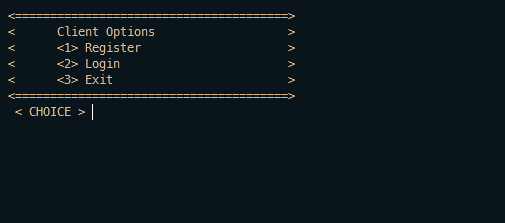

 
<h3>
A Terminal-based Loan Amortization Console Program
</h3>
A Terminal-based Loan Amortization Program that I made way back in 18'.

## About the Program
As mentioned, the objective of this program is to create program that imitates how a Loan Amortization plans work and make it into a simple terminal-based program  
wherein User can be the Client or the Lender the main purpose of this program is to learn how real-life problems be solved using software.

Clients should be able to do the ff:
* Create an Account
* Apply for a Loan
* Able to Pay for their Loan
* View the Amortization Table
* Logout

Lenders should be able to the ff:
* Create an Account
* Approve/Decline Client's Loan Application
* View all master list of Client information

This program is probably not the best for beginners due to the nature of the code which is filled with bad practices, however if you still want to learn it, you'll probably learn a thing or two about scoping, reusability, a sprinkle of OOP and data structures especially Linked Lists and its basic operations.

### Built with
This Terminal-based program is built with C++

## Getting Started
### Prerequisites
Make sure you have <a href="https://gcc.gnu.org/install/">`gcc/g++`</a> installed in your desktop/laptop
#### Installation
  1. Clone the repository or download it as zip, if you don't know how; <a href = "https://www.howtogeek.com/451360/how-to-clone-a-github-repository/">Click here</a>
  2. If you didn't download it locally or if you're working with terminals you can paste this code `git checkout -t origin/ConsolePrograms`
  3. If all is good you can now proceed to compile the main file inside the `./src` directory of chosen terminal-based program directory
  4. Enjoy! Don't forget to ⭐ the repo!

  ## Sample

  ###### Menu of the Program
  

  ### Client
  
  Client Options

    

  Client Dashboard

  
  
  Client Amortization Table
  
  
  
  

  ### Lender
  
  Lender Options
  
  
  
  Lender Dashboard
  
  
  
  Lender Client List
  
  

  ## Contribution
Contributions are what make the open source community such an amazing place to be learn, inspire, and create. Any contributions you make are greatly appreciated.

* Fork the Project
* Create your Feature Branch `(git checkout - b feature/AmazingFeature)`
* Commit your Changes `(git commit -m 'Add some AmazingFeature')`
* Push to the Branch `(git push origin feature/AmazingFeature)`
* Open a Pull Request

## Contact
Sean Christian Lozana - https://github.com/lozanasc - https://twitter.com/lozanascboi  
Project Link - https://github.com/lozanasc/lozanasc_school
